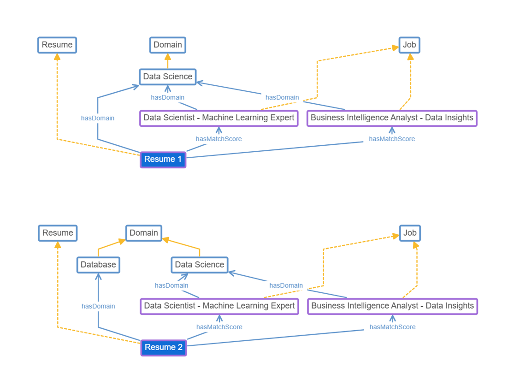

# Ontology-Based-Semantic-Matching-For-Recruitment
This repository showcases the prototype of the paper titled "Ontology-Based Semantic Matching for A Real-Time Online Recruitment Application Portal". 

```
@article{...,
title={Ontology-Based Semantic Matching for A Real-Time Online Recruitment Application Portal},
author={Ajjam, Hassan and AL-RAWESHIDY, HAMED},
journal={...},
  pages={...},
  year={...},
  publisher={...},
  note={Under review}  
}
```
# Ontology Development 
As proof of concept, to support transparency, reproducibility, and future enhancement, the developed ontologies are publicly available on GitHub. The ontology captures the semantic interrelationship between job titles and resume domains, enabling intelligent alignment between candidates and job postings based on domain-specific context. It defines structural classes such as Job and Resume and semantic properties such as hasDomain and hasMatchScore. The ontology is provided in OWL format and can be imported into Protégé and WebProtege. 

<p align="center">
  
</p>

# Usage
To open the ontology graph, do the following steps:
1. Download the ontology graph file from the [ontology](https://github.com/HassanAjjam2/Ontology-Based-Semantic-Matching-For-Recruitment/tree/main/ontology) folder.
2. Import the downloaded file into the WebPortege.
3. Open the project to view the graph.  
